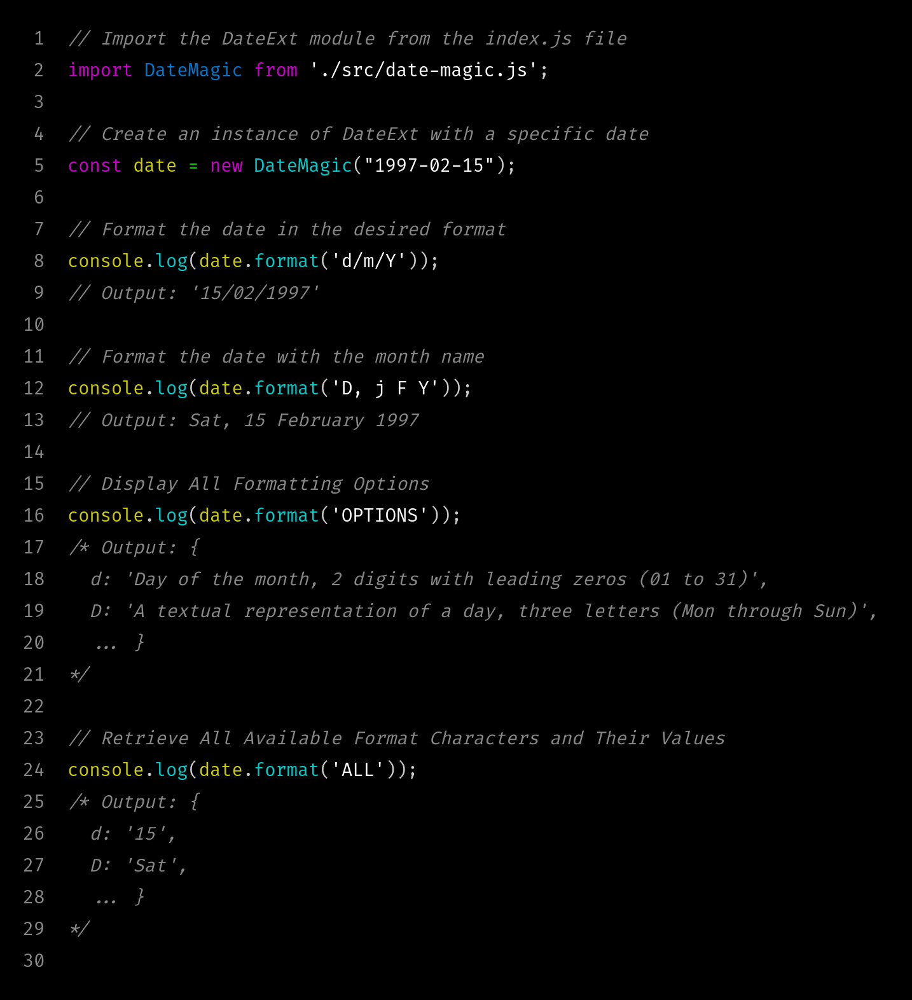

# DateMagic

DateMagic is a JavaScript library that extends the functionality of the native Date object by adding a `format()` method, allowing you to format dates according to specified patterns.



## Installation

You can install DateMagic via npm:

```bash
npm install date-magic
```

## Usage

To use DateMagic in your project, simply import it and call the `format()` method on a Date object:

```javascript
import DateMagic from "date-magic";

// Create an instance of DateMagic
const date = new DateMagic("1997-02-15");

// Format the date in the desired format
console.log(date.format("d/m/Y"));
// Output: '15/02/1997'

// Format the date with the month name
console.log(date.format("D, j F Y"));
// Output: Sat, 15 February 1997

// Display All Formatting Options
console.log(date.format("OPTIONS"));
/* Output: {
  d: 'Day of the month, 2 digits with leading zeros (01 to 31)',
  D: 'A textual representation of a day, three letters (Mon through Sun)',
  ... }
*/

// Retrieve All Available Format Characters and Their Values
console.log(date.format("ALL"));
/* Output: {
  d: '15',
  D: 'Sat',
  ... }
*/
```

## License

This project is licensed under the GPL-3.0 License - see the [LICENSE.txt](LICENSE.txt) file for details.
